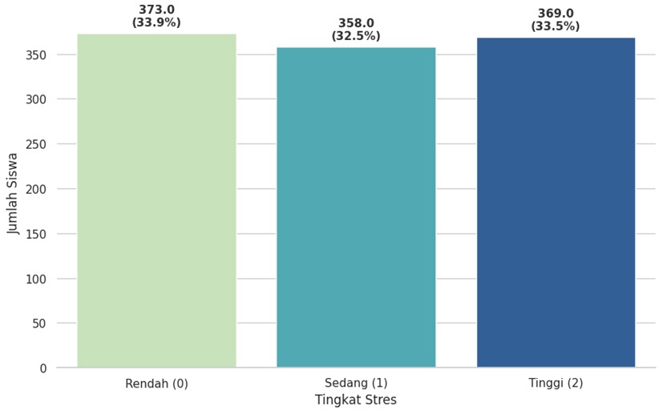
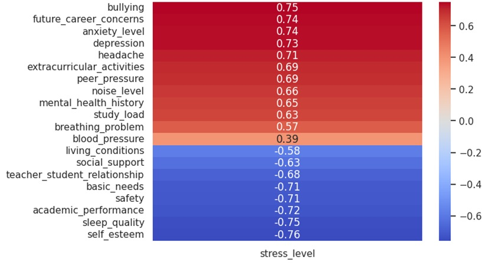

# Student Stress Level Classification

## Overview
This project applies machine learning techniques to classify student stress levels based on psychological, physiological, academic, and social factors.

Early identification of stress levels can help institutions provide better academic and mental health support for students.

## Dataset
Student Stress Level Dataset (Kaggle)

- 1100 samples
- 21 features
- Target: `stress_level`

Stress level categories:
- 0 → Low stress
- 1 → Medium stress
- 2 → High stress

## Methods
Workflow of the project:

- Data preprocessing
- Feature scaling using StandardScaler
- Dimensionality reduction using PCA
- Model training and evaluation

Machine learning models used:

- k-Nearest Neighbors (kNN)
- Support Vector Machine (SVM)
- Multilayer Perceptron (MLP)

## Results

Model performance on the test dataset:

- kNN → ~90% accuracy  
- SVM → ~89% accuracy (after hyperparameter tuning)  
- MLP → ~88% accuracy  

A **two-stage classification approach** improved the overall accuracy to **~92.7%**.

## Visualization

### Stress Level Distribution

### Fiture Correlation

## Project Information
Machine Learning and Artificial Intelligence course  
Institut Teknologi Bandung

Team members:
- Ashma Nisa Sholihah Adma
- Izzah Huwaidah
- Ilmania Syakira
- Akhmad Rosyidan
- Citra Nauli Al Fariz
- Isna Zakhiyah
